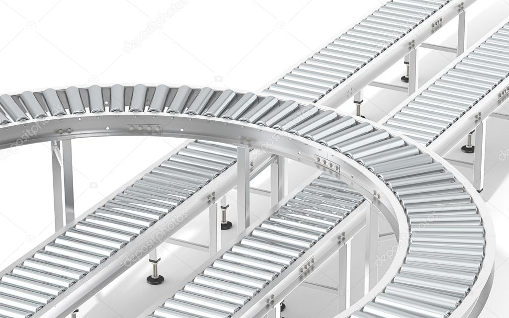
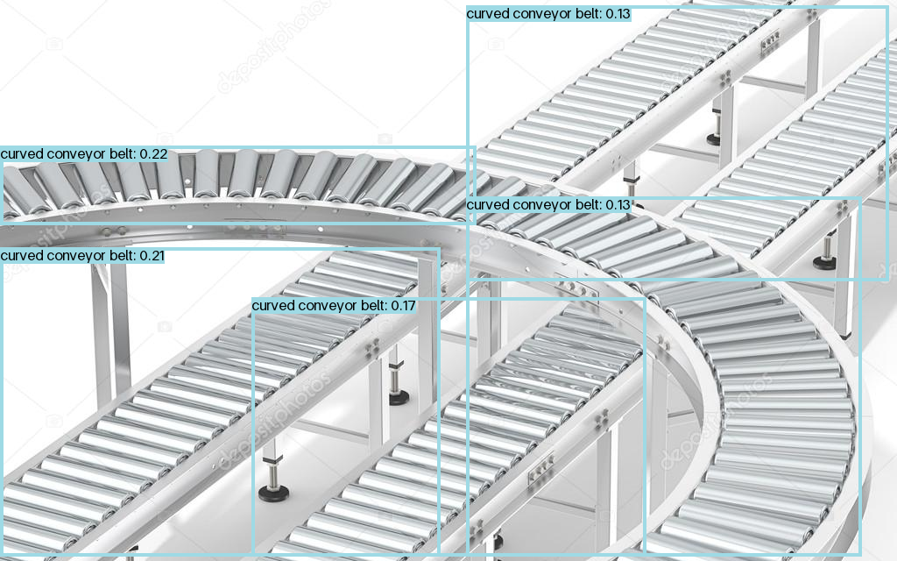

# VisAgent-Proto

Prototype of a Vision Agent using code generated by [va.landing.ai](https://va.landing.ai) for [landing.ai Vision Agents](https://landing.ai/visionagent) locally.


[](https://www.codefactor.io/repository/github/qte77/VisAgent-Proto)
[](https://github.com/qte77/VisAgent-Proto/actions/workflows/codeql.yaml)
[](https://github.com/qte77/VisAgent-Proto/actions/workflows/ruff.yaml)
[](https://github.com/qte77/VisAgent-Proto/actions/workflows/pytest.yaml)
[](https://github.com/qte77/VisAgent-Proto/actions/workflows/links-fail-fast.yaml)
[](https://github.com/qte77/VisAgent-Proto/actions/workflows/generate-deploy-mkdocs-ghpages.yaml)
[](https://vscode.dev/github/qte77/VisAgent-Proto)

## Status

(DRAFT) (WIP) ----> Not fully implemented yet

For version history have a look at the [CHANGELOG](CHANGELOG.md).

## Setup

`make [setup_dev|setup_prod]`

Hint: `OpenGL` libraries might get installed headless even if already present in environment.

## Usage

### CLI

`make run_cli`

### Web Deployment

This app has been deployed with the above question prompt as task.
You can use [the streamlit app on landing.ai](https://qbwc15b-streamlit.sandbox.landing.ai?embed=True) or the following API request.

```sh
curl -X 'POST' \
  'https://qbwc15b-webendpoint.sandbox.landing.ai/inference' \
  -H "Content-Type: application/json" \
  -H 'Authorization: Basic {{your_api_key}}' \
  -d '{ "{{your_param_name}}": "{{image_url}}" }'
```

## Examples

### Question

```sh
Can you perform object detection to identify the different sections of the conveyor belt system
in the image,focusing on distinguishing between straight and curved parts?
```



### Answer

```sh
I've analyzed the image and detected the conveyor belt sections. Here are the results:
- Curved sections detected: 5
- Straight sections detected: 0
- Total length of curved sections: 1668667.8016 (in pixel units squared)
A visualization of the detected sections has been saved as 'conveyor_belt_detection.jpg'.
Would you like to see this visualization or do you need any further analysis?

[{'straight_sections_count': 0,
  'curved_sections_count': 5,
  'total_straight_length': 0,
  'total_curved_length': 1668667.8016,
  'visualization_path': 'conveyor_belt_detection.jpg'}]
```



## Documentation

`TODO`

Uses [va.landing.ai](https://va.landing.ai/demo).

<!--
- **Project DSL**: See [docs/project_dsl.txt](docs/project_dsl.txt) for a high-level overview of the project structure and functionality.
- **PRD**: See [docs/PRD.md](docs/PRD.md) for detailed product requirements.
-->

### Architecture

`TODO`

<!--


-->

## Project Structure

```sh
TODO
```

## TODO
